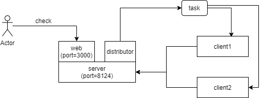
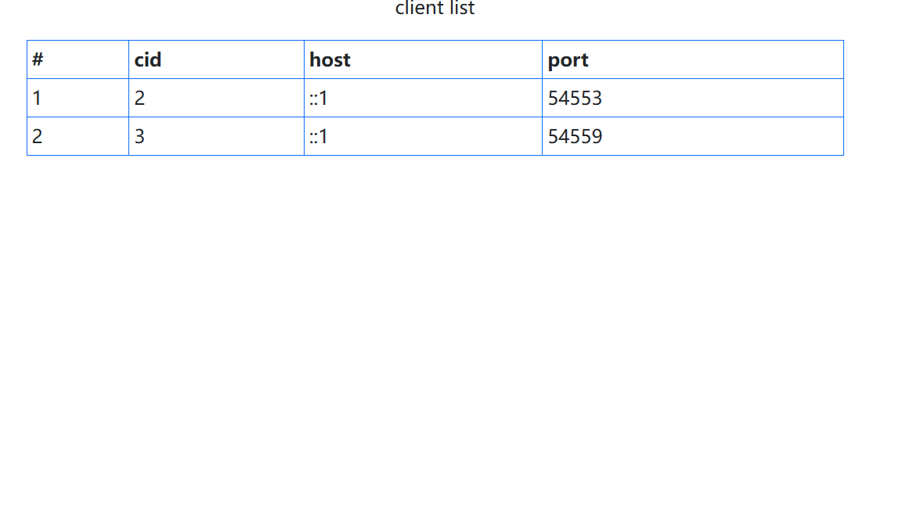

# 架构



如上图，我想做成一个通用的nodejs分布式框架

- server 端，负责和client通信
- client 端 或称worker 端，负责执行任务
- web 给客户端提供页面，查看状态，发送命令
- distributor 负责将任务分配给worker


# 步骤
1. node server.js
```
web started,running on http://192.168.0.172:3000/
server started,running on 192.168.0.172:8124
```
2. 运行多个node client.js

3. 浏览器访问 http://192.168.0.172:3000/



# wukong
# wukong
# wukong
